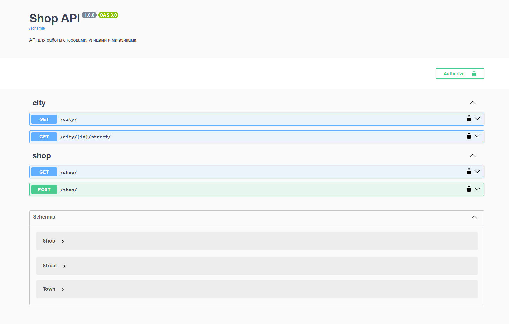
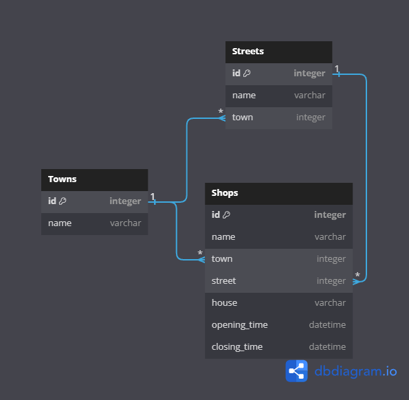

# Сервис магазинов

## API



API задокументирован при помощи Swagger `drf-spectacular`.

Тестирование API: `http://127.0.0.1/swagger/`

Документация: `http://127.0.0.1/redoc`

JSON: `http://127.0.0.1/.../`

## База данных



Связи между сущностями:

- Улица к городу: `многие к одному`;

- Магазин к улице: `многие к одному`;

- Магазин к городу: `многие к одному`.

СУБД: `PostgreSQL 15 версии`.

ORM: `Django ORM`.

## Конфигурирование


## Деплой

### 1. Ручной вариант


Сервис будет доступен на `localhost:8000`.

### 2. Docker

> [!WARNING]  
> В системе должен быть установлен Docker и Docker Compose.

```bash
docker-compose up -d --build
```

Сервис будет доступен на `localhost:80`.

### 3. Vagrant

> [!WARNING]  
> Должен быть установлен Vagrant и VirtualBox.

> [!TIP]
> Базовый box можно скачать [отсюда](https://portal.cloud.hashicorp.com/vagrant/discover/ubuntu/focal64).

```bash
vagrant up
```

Сервис будет доступен на `localhost:80`.

## Управление проектом через Make

> [!IMPORTANT]  
> Актуально для вариантов деплоя 2 и 3.

- Сборка и запуск стека приложений:

```bash
make build
```

- Запуск ранее собранного стека приложений:

```bash
make up
```

- Остановка стека приложений:

```bash
make down
```

- Перестроить стек приложений с удалением всех контейнеров и томов:

```bash
make rebuild
```

- Очистить все контейнеры, сети и тома:

```bash
make clean
```

- Вывести логи:

```bash
make logs
```
