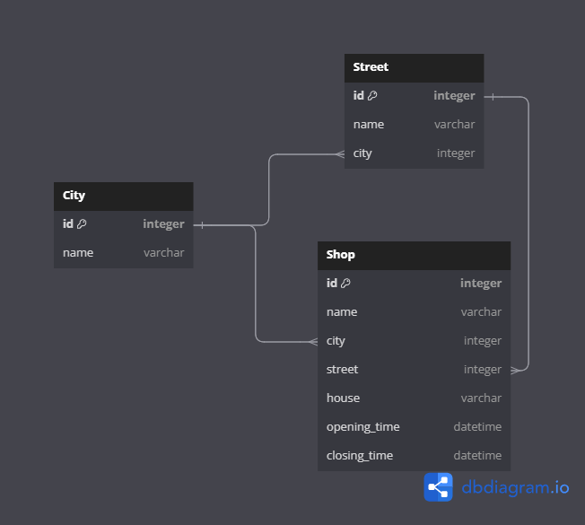

# Сервис магазинов

## Зависимости

Версия Python - `3.12`.

| Зависимость         | Версия       |
|---------------------|--------------|
| Django              | `5.1.2`      |
| djangorestframework | `3.15.2`     |
| drf-spectacular     | `0.27.2`     |
| psycopg2-binary     | `2.9.10`     |
| gunicorn            | `23.0.0`     |


## REST API


API задокументирован при помощи Swagger (`drf-spectacular`).

Тестирование API: `http://127.0.0.1/swagger/`

YAML: `http://127.0.0.1/schema/`

## База данных



Связи между сущностями (представлено на диаграмме):

- Улица к городу: `многие к одному`;

- Магазин к улице: `многие к одному`;

- Магазин к городу: `многие к одному`.

СУБД: `PostgreSQL 15 версии`.

ORM: `Django ORM`.

## Админка Django


- Админка Django доступна по адресу `http://127.0.0.1/admin`.

- Учётные данные для первого входа: `admin:admin`.

> [!IMPORTANT]
> Учётные данные рекомендуется сменить сразу после развёртывания на более устойчивые.

- Также автоматически генерируются данные в БД сервиса для моделей города, улицы и магазина.

- Автогенерация данных в сервиса автоматизирована с помощью кастомной команды:

```shell
python3 manage.py initdb
```

Реализовано тут: `api/management/commands/initdb.py`.

> [!TIP]
> После каждого перезапуска стека приложений база обогащается случайными данными.

## Конфигурирование

В корне репозитория создайте `.env` файл со следующим содержимым:

```
API_URL=127.0.0.1
API_PORT=80
POSTGRES_HOST=db
POSTGRES_PORT=5432
POSTGRES_USER=postgres
POSTGRES_PASSWORD=postgres
POSTGRES_DB=shop_database
```

Переменные окружения в конфигурации:

- `API_URL`: адрес, на котором будет развёрнут сервис;

- `API_PORT`: порт, на котором будет принимать запросы сервис;

- `POSTGRES_HOST`: хост базы данных (имя сервиса в стеке приложений);

- `POSTGRES_PORT`: порт базы данных;

- `POSTGRES_USER`: пользователь базы данных;

- `POSTGRES_PASSWORD`: пароль от базы данных;

- `POSTGRES_DB`: имя базы данных, используемой сервисом.

## Запуск проекта

Для начала клонируйте репозиторий:

```shell
git clone https://github.com/light-hat/shop_service
cd shop_service
```

Далее предлагается два варианта на выбор:

> [!NOTE]
> Сервис в обоих случаях будет доступен на `127.0.0.1:80`.

### 1. Docker

> [!WARNING]  
> В системе должны быть установлены `Docker` и `Docker Compose`.

```shell
docker-compose up -d --build
```

### 2. Vagrant

> [!WARNING]  
> Должны быть установлены `Vagrant` и `VirtualBox`.

> [!TIP]
> Базовый box `ubuntu/focal64` можно скачать [отсюда](https://portal.cloud.hashicorp.com/vagrant/discover/ubuntu/focal64).

```shell
vagrant up
```

## Управление проектом через Make

> [!IMPORTANT]
> Для этого в системе должен быть установлен `Make`. При развёртывании через Vagrant, make устанавливается на виртуальную машину автоматически.


Для автоматизации работы с docker-compose предлагается использование утилиты Make.

- Сборка и запуск стека приложений:

```shell
make build
```

- Запуск ранее собранного стека приложений:

```shell
make up
```

- Остановка стека приложений:

```shell
make down
```

- Перестроить стек приложений с удалением всех контейнеров и томов и без кеширования:

```shell
make rebuild
```

- Очистить все контейнеры, сети и тома:

```shell
make clean
```

- Вывести логи:

```shell
make logs
```

- Автоформатирование через `black`:

```shell
make black
```

- Проверить статус контейнеров:

```shell
make status
```

## Модульное тестирование

Не успел уже =(

Сделано, но мало, только для модели Shop. Тестируется создание модели, сериализатор POST-запроса и вьюха фильтра магазинов.
